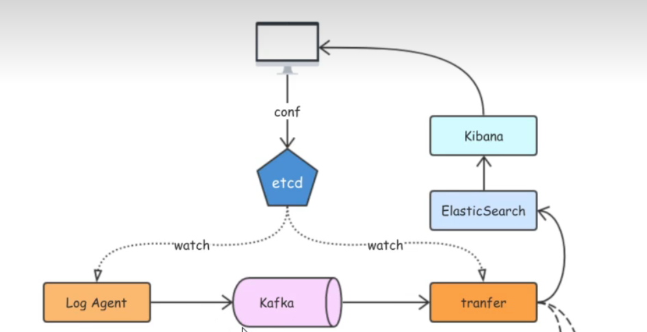

# logagent
日志收集

- 原项目视频教程 [李文州老师go实现日志收集](https://www.bilibili.com/video/BV1Df4y1C7o5?spm_id_from=333.337.search-card.all.click)
- 大致流程：程序从etcd中获取要读取的日志文件路径，以及要发送到kafka哪个topic下，利用`hpcloud/tail`包(用于本地读取文件)，读取etcd中指定的文件，一个文件一个协程，把收集到的日志数据发送到kafka
- etct配置的key设置为`collect_log_%s_conf`,%s替换为ip地址
- etcd和kafka请在/conf/config.ini中配置
- 启动`go run main.go`
- 架构图如下
 
- 我这儿没有实现tranfer部分逻辑，tranfer主要负责消费kafka中的日志数据，落到es中，es通过配置kibana进行数据展示,跟踪
